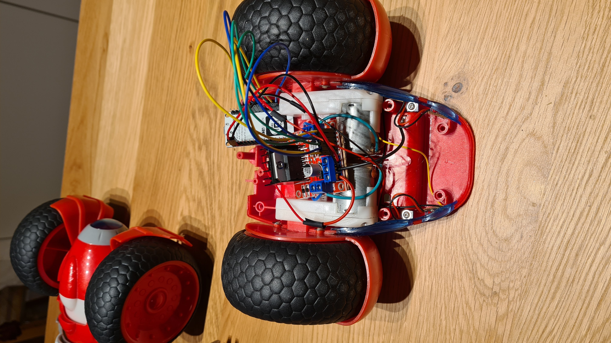

# ESP8266 RC Car Controller

## 1. Overview

This project implements a compact Wi-Fi controlled RC car based on the ESP8266 microcontroller. The system exposes a browser-based control interface, receives joystick commands over WebSockets, and converts them into motor drive signals for a two-wheel chassis.

The firmware is located in [src/RcCarFs.ino](src/RcCarFs.ino). Browser assets live only in [src/data](src/data) and are served from the ESP8266 LittleFS filesystem, rather than being duplicated as generated C++ headers in the firmware. A lightweight mock WebSocket server is also included under [jsmock](jsmock) for local testing and protocol validation without hardware.

---

## 2. Purpose and Scope

The goal of the project is to provide a simple remote-control platform with the following characteristics:

- low-cost hardware based on ESP8266
- no dedicated mobile app required
- browser access over Wi-Fi
- two independent drive channels for left and right wheels
- simple state synchronization via WebSocket
- optional LED control as a basic accessory feature

This document serves as the functional specification for the project and captures the expected behavior, interfaces, and software architecture.

---

## 3. System Specification

### 3.1 Functional Requirements

FR-01: The controller shall start as an access point and expose a web interface on the local network.

FR-02: The browser interface shall allow the user to control the vehicle using two virtual joysticks, one for the left side and one for the right side.

FR-03: Both joysticks shall operate along the vertical axis only, producing forward and reverse motion.

FR-04: The controller shall convert joystick movement into signed motor values in the approximate range from -255 to +255.

FR-05: The controller shall maintain the state of:

- `isBlueLedOn`
- `leftMotor`
- `rightMotor`

FR-06: The user shall be able to toggle a blue LED from the web interface.

FR-07: The WebSocket channel shall be used to send control updates from the browser to the ESP8266.

FR-08: The firmware shall apply motor actuation in the main loop using a dead zone and direction logic.

FR-09: When the joystick returns to neutral, both motors shall stop.

FR-10: If a client connects, the server shall send the current state immediately to synchronize the UI.

### 3.2 Non-Functional Requirements

NFR-01: The controller shall be usable from a browser on a phone or laptop connected to the same Wi-Fi network or the ESP access point.

NFR-02: The design shall prioritize simplicity and low hardware cost over advanced telemetry or autonomous driving.

NFR-03: The firmware shall be lightweight enough to run on an ESP8266 with limited RAM and flash.

NFR-04: The UI shall be self-contained and served directly by the ESP8266 without external dependencies at runtime.

---

## 4. System Architecture

### 4.1 Hardware Architecture

The project targets an ESP8266-based chassis with two DC motors and an H-bridge style drive arrangement.

The pin mapping used by the firmware is:

| Signal | ESP8266 Pin | Purpose |
| --- | --- | --- |
| `iBlueLedPin` | `LED_BUILTIN` | Built-in blue status LED |
| `iLightLedPin` | `D8` | Additional lighting output |
| `pwmMotorA` | `D2` | PWM for right motor |
| `in1MotorA` | `D1` | Direction control for right motor |
| `in2MotorA` | `D3` | Direction control for right motor |
| `pwmMotorB` | `D6` | PWM for left motor |
| `in1MotorB` | `D5` | Direction control for left motor |
| `in2MotorB` | `D7` | Direction control for left motor |

The firmware configures the board to power the DC motors from the ESP8266 GPIO outputs and uses PWM to approximate analog motor speed control.

### 4.2 H-Bridge Wiring Reference

The motor driver is connected between the ESP8266 GPIO pins and the DC motors through a dual H-bridge module. The project uses one H-bridge channel for the right motor and one for the left motor.

```text
ESP8266                         H-Bridge module                         Motors
-------------------------------------------------------------------------------------------
D1  -----------------------> IN1 (right motor direction)          OUT1 ----> Right motor terminal A
D3  -----------------------> IN2 (right motor direction)          OUT2 ----> Right motor terminal B
D2  -----------------------> ENA (right motor PWM)

D5  -----------------------> IN3 (left motor direction)           OUT3 ----> Left motor terminal A
D7  -----------------------> IN4 (left motor direction)           OUT4 ----> Left motor terminal B
D6  -----------------------> ENB (left motor PWM)

GND -----------------------> GND
5V ------------------------> H-bridge VCC / motor supply
```

The exact firmware mapping is:

- Right motor: `pwmMotorA = D2`, `in1MotorA = D1`, `in2MotorA = D3`
- Left motor: `pwmMotorB = D6`, `in1MotorB = D5`, `in2MotorB = D7`

#### Real wiring photo



#### ASCII schematic

```text
                 +------------------------------+
                 |        ESP8266 D1 R2         |
                 |                              |
                 | D1 ---- IN1A  (right motor)  |
                 | D3 ---- IN2A  (right motor)  |
                 | D2 ---- ENA   (PWM right)    |
                 |                              |
                 | D5 ---- IN1B  (left motor)   |
                 | D7 ---- IN2B  (left motor)   |
                 | D6 ---- ENB   (PWM left)     |
                 |                              |
                 | GND ----------------------> GND
                 | 5V  ----------------------> VCC / motor supply
                 +------------------------------+
                               |
                               |
                               v
                 +------------------------------------+
                 |        Dual H-bridge driver        |
                 |                                    |
                 | Right channel:                     |
                 |   ENA -> PWM speed                 |
                 |   IN1A, IN2A -> direction          |
                 |   OUT1A, OUT2A -> right motor      |
                 |                                    |
                 | Left channel:                      |
                 |   ENB -> PWM speed                 |
                 |   IN1B, IN2B -> direction          |
                 |   OUT1B, OUT2B -> left motor       |
                 |                                    |
                 +------------------------------------+
                              |             |
                              |             |
              Right motor ----+             +---- Left motor

                   Logical direction mapping:
                   - IN1A/HIGH + IN2A/LOW  -> right motor forward
                   - IN1A/LOW  + IN2A/HIGH -> right motor reverse
                   - IN1B/HIGH + IN2B/LOW  -> left motor forward
                   - IN1B/LOW  + IN2B/HIGH -> left motor reverse
```

This H-bridge wiring is documented in more detail in [docs/h-bridge-wiring.md](docs/h-bridge-wiring.md).

### 4.3 Software Architecture

The software consists of three main parts:

1. Embedded firmware in [src/RcCarFs.ino](src/RcCarFs.ino)
   - creates a Wi-Fi access point or joins a station network
   - hosts an HTTP server
   - serves the web interface and static JavaScript
   - maintains the WebSocket connection
   - listens for state updates and applies them to the motors and LED

2. Static web assets in [src/data](src/data), stored on LittleFS
   - HTML UI with a toggle for the LED and two control zones
   - JavaScript for the virtual joysticks and WebSocket client

3. Mock server in [jsmock/index.js](jsmock/index.js)
   - Node.js Express + WebSocket implementation
   - reproduces the control protocol for testing and debugging
   - allows browser-based UI testing without the ESP8266 board

---

## 5. User Interface Specification

The UI is served from the root URL and is designed for mobile or desktop browsers.

### 5.1 Layout

- Top section: blue LED toggle
- Left section: left joystick control
- Right section: right joystick control

The front-end uses the NippleJS library to create the two virtual joysticks.

### 5.2 Control Behavior

- `leftMotor` is controlled by the left joystick.
- `rightMotor` is controlled by the right joystick.
- The joysticks only use the Y (vertical) axis.
- Upward movement produces positive values.
- Downward movement produces negative values.
- When the joystick is released, the corresponding motor value is reset to 0.

### 5.3 LED Behavior

The LED toggle sends a JSON update message when the checkbox changes.

Example payload:

```json
{
  "action": "update",
  "value": {
    "isBlueLedOn": true
  }
}
```

---

## 6. Communication Protocol

The controller communicates with the browser over WebSockets. The protocol is JSON-based and uses a minimal action/value structure.

### 6.1 Message Format

```json
{
  "action": "update",
  "value": {
    "leftMotor": 120,
    "rightMotor": -90,
    "isBlueLedOn": true
  }
}
```

### 6.2 Supported Actions

#### `message`

Used for diagnostic traffic.

Example:

```json
{
  "action": "message",
  "value": "OK"
}
```

#### `update`

Used to send state changes to the firmware. Any subset of the following keys may be present:

- `isBlueLedOn`: boolean
- `leftMotor`: integer from `-255` to `255`
- `rightMotor`: integer from `-255` to `255`

The `value` must be an object. Invalid values reject the complete update without
changing the state. When a client connects, it receives an `update` containing
the complete current state.

### 6.3 Firmware Handling

On receiving a WebSocket payload, the firmware checks for the `action` field and then updates the relevant internal state using helper functions such as:

- `setBlueLedOn(bool value)`
- `setLeftMotor(int value)`
- `setRightMotor(int value)`

The `handleWebSocketMessage` function validates the payload and updates the state accordingly.
The local mock server in `jsmock` applies the same action, type, and motor-range
checks so the protocol can be exercised without hardware.

---

## 7. Motor Control Logic

The core drive logic is implemented in the `loop()` function.

### 7.1 Dead Zone and Direction Logic

The code treats values near zero as stopped. In practice, it uses a threshold behavior:

- if `state.rightMotor > 70`, the right motor runs forward
- if `state.rightMotor < -70`, the right motor runs backward
- otherwise, the right motor is stopped

The same pattern is used for the left motor.

The direction pins are configured as follows:

- forward: `HIGH` on one input, `LOW` on the other
- reverse: `LOW` on the first input, `HIGH` on the second
- stop: both inputs `LOW`, PWM set to 0

### 7.2 Output Mapping

The code uses `analogWrite` for PWM speed control and digital pins for direction selection. This provides a simple, effective method for controlling the two wheel motors independently.

---

## 8. Wi-Fi Behavior

The board is configured with two modes.

### 8.1 Access Point Mode (default)

The Wi-Fi mode and AP credentials are set in the local, untracked `src/wifi_config.h`
file:

1. Copy [src/wifi_config.example.h](src/wifi_config.example.h) to `src/wifi_config.h`.
2. Set `RC_CAR_WIFI_MODE_AP` to `1` for AP mode (default) or `0` for STA mode.
3. Set `RC_CAR_DEBUG_LEVEL` from `0` (no logs), `1` (errors), `2` (normal status
   messages), or `3` (detailed WebSocket and control-state logs). The default is `2`;
   disabled log calls are removed at compile time. At info level, free heap, largest
   free block, and heap fragmentation are logged at startup and every 10 seconds.
4. For AP mode, set `WIFI_AP_SSID` and `WIFI_AP_PASSWORD` to values of your choice.
   Use a unique password of at least 8 characters.

This allows a client to connect directly to the car without additional infrastructure.
The firmware redirects DNS requests and unknown web URLs to the controller, so supported
phones and computers can open its control page automatically after connecting. If the
device does not show a captive-portal prompt, open any web page or visit
`http://192.168.4.1`.

### 8.2 Station Mode (optional)

When `RC_CAR_WIFI_MODE_AP` is set to `0`, the board connects to an external Wi-Fi
network using `WIFI_STA_SSID` and `WIFI_STA_PASSWORD` from the same local config file.
The local config file is ignored by Git; do not commit real credentials.

---

## 9. Build and Run Instructions

### 9.1 Embedded Firmware

The firmware is written for the Arduino ecosystem and targets an ESP8266 board such as the LOLIN(WEMOS) D1 R2 / mini.

Required libraries (LittleFS is included with the ESP8266 Arduino core):

- `ESP8266WiFi`
- `DNSServer`
- `ESPAsyncTCP`
- `ESPAsyncWebServer`
- `ArduinoJson`

Steps:

1. Open the sketch in the Arduino IDE or PlatformIO.
2. Copy `src/wifi_config.example.h` to `src/wifi_config.h`, choose AP or STA mode, and
   enter the corresponding Wi-Fi credentials.
3. Install the required libraries.
4. Select the correct ESP8266 board and COM port.
5. Select a flash layout with enough space assigned to LittleFS for the files in
   `src/data/`.
6. Build and upload the sketch.
7. Upload the contents of `src/data/` to the board's LittleFS filesystem using an
   ESP8266 LittleFS filesystem uploader. This is a separate step from uploading
   the sketch; repeat it whenever the web assets change.
8. In AP mode, connect to the name configured as `WIFI_AP_SSID`.
9. In AP mode, the control page should open automatically; if it does not, visit
   `http://192.168.4.1`. In STA mode, open the IP address printed to the serial monitor.

### 9.2 Mock Server

The mock server in [jsmock/index.js](jsmock/index.js) can be used for protocol validation.

From the [jsmock](jsmock) folder:

```bash
npm install
npm start
```

Then open the browser at:

```text
http://localhost:3000
```

This server simulates the same WebSocket state updates and mirrors the browser-side behavior for development and testing.

---

## 10. Project Structure

```text
.
├── README.md
├── jsmock/
│   ├── index.js
│   └── package.json
└── src/
    ├── RcCarFs.ino
    └── data/
        ├── index.html
        └── nipplejs.js
```

---

## 11. Current Constraints and Known Limitations

- The project is designed for a simple prototype chassis and is not a complete production-grade robot control system.
- Wi-Fi credentials are hardcoded in the firmware.
- The UI is intentionally minimal and uses a basic joystick model.
- There is no advanced safety layer, battery monitoring, odometry, or autonomous navigation.
- The WebSocket messages are plain JSON without authentication or encryption.

---

## 12. Future Improvements

Potential expansions include:

- configurable Wi-Fi credentials via captive portal
- camera streaming or telemetry dashboard
- obstacle detection and collision avoidance
- speed calibration and smoother acceleration profiles
- remote drive mode with a single joystick or gamepad support
- persistent settings stored in EEPROM or SPIFFS

---

## 13. Summary

This project delivers a lightweight ESP8266-driven RC car controller with a browser interface, joystick-based drive inputs, and live state synchronization over WebSockets. The implementation is intentionally small and easy to understand, making it suitable as a base for further experimentation and extension.
